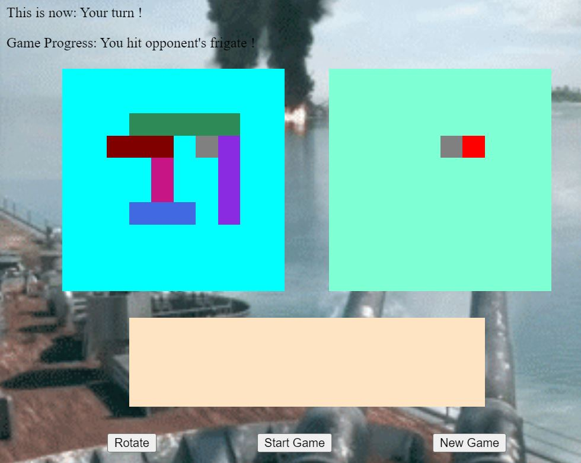

# Developing a Battleship browser game with minimalist design

## Game Description

#### Title: _Deep Ocean battle_ aka _Abyssal Armada: Conqueror of the Deep_

Background: This is a mini strategic guessing game that derives from "Battleship", a former pencil and paper game dated since World War I. It was published by various companies as a pad-and-pencil game in the 1930s and was released by Milton Bradley in 1967 as a plastic board game, which was deemed as pioneer version of the subsequent releases of the electronic and computerized versions of the game.

In this project, the game is modified to PVE, where player will play against the computer, instead of the traditional two-player mode. Prior to the start of the game, player will need to construct the battleship frontline by dropping different ships (blocks) into the oceans (board). After all ships are deployed, player shall start the game. It will take turns for the player and computer to choose the location on the opponent's ocean where they want to launch attack. The goal is to destroy all parts of your opponent's ship to sink the ship. The game ends when all the ships from either the computer or player get sunk, whichever happens first.

## Game Design

Before getting into the code for this game, I drew out the block diagrams with the components that I wished to implement after actually trying to play the various versions of the game and referencing developers' ideas in the game structure and visualization.

The initial sketch of the game framework is illustrated as following. Although there are some style changes moving down the development path, the core structure of the game remains.

<kbd>Before game starts</kbd>

<kbd>After game starts</kbd>

 

Milton Bradley's concept of ships vs mine

<table>
<tr>
<th>Milton Bradley</th>
<th>Mine</th>
</tr>
<tr>

<td>

| No. | Class of ship | Size |
| --- | ------------- | ---- |
| 1   | Carrier       | 5    |
| 2   | Battleship    | 4    |
| 3   | Cruiser       | 3    |
| 4   | Submarine     | 3    |
| 5   | Destroyer     | 2    |

</td><td>

| No. | Class of ship | Size |
| --- | ------------- | ---- |
| 1   | Frigate       | 5    |
| 2   | Corvette      | 3    |
| 3   | Cruiser       | 3    |
| 4   | Submarine     | 2    |
| 5   | Destroyer     | 4    |

</td></tr> </table>

## Technologies Used

Minimalist design - utilize only what has been deemed essential

- HTML
- CSS
- JavaScript
- Git & GitHub

## Deployment

The game has been deployed on Vercel. Try and play it here: https://project-battleship.vercel.app/

## Get Started

To start off, player shall drag and drop the ship blocks into the board located at the left, according to his/her preference. Click the "Rotate" button to align the ship 90 degrees or 180 degrees. After all ships have been placed, click "Start Game" button to initiate player's first move.

Player can click anywhere within the computer's board (right side). The info panel at the top left-hand corner indicates whose turn it is now and the game progress on whether target has been hit/missed. Refer to the screenshot below, field in red indicates the compartment of the ship being hit. While the one in gray indicates a miss of target. Player will have a favor so he/she will gain a new turn after hitting the target.

Despite of the message, player will notice a "gunshot" sound - when the compartment is hit, or "water-splash" sound - when nothing is hit other than the water surface. When all compartments of a ship get hit, the ship is sunk.

When all opponent’s ships get sunk, woohoo, congrats to whom that won the game! You can now close the prompt and click on "New Game" to start a fresh game.

> [!NOTE]
>
> > 1.  You need to place all the ships before clicking "Start Game", else you will be prompted to do so.
> >
> > 2.  Computer will generate the ships at random locations but the ship patterns are the same as player's.
> >
> > 3.  You will not be able to undo any step once made, so take careful considerations!
> >
> > 4.  Sit back and relax while playing the game, do allow few seconds for yourself and the computer to think and react correspondingly.

## Future Enhancement

In a future perspective of this project, there is still much room for improvement, which may include but not limit to features such as:

- Incorporating thrilling background music to loop before the start of the game phase.
- CSS styling to make better game visuals such as animating the effect of ship being attacked, changing the shape of the ships and the way how compartment displays when hit.
- Improving user accessibility by changing font size, element position, height and width etc, under different media size. Rendering alt text and captions for screen readability.

## Key Learnings

1. Structure the game e.g., framework, layout, functional block diagrams etc before going straight into the code. This is essential especially when you need to write a lot of functions which co-relate to one another in your application.
2. Try to write logical conditions (if...else; while etc). I have come across to various situations where the actual outcome of execution does not meet desired expectation eventhough the conditional statement looks rational to me. The idea is to write shorter and less complex statements and break down the chunks into more segments.
3. Prepare and write pseudo codes. Pseudo codes makes the actual progamming later much easier. This improves the readability of any approach, and works as a rough documentation so that the code construction phase can be initiated with ease.
4. This may not be your style, but this is my style to comment on the code blocks frequently as I progress down the path such that I can trace back during debugging. It could also be a better practice to structure your codes in a logical flow, for example, you should declare all the possibly needed variables before moving on to functions. Put the variables in the global scope when you know they will be used later.

## Reference

As someone who has zero prior knowledge of the game before taking up this project, I referenced various sources to learn the techniques and get ideas on how others crafted their game, and adapted and modified as much as I deemed necessary to be a game of my own brand.

- [Battleship - The Game](https://jhonny-chamoun.medium.com/battleship-the-game-step1-userinterface-and-game-logic-8abba52746cd)
- [Let's Build Battleships in JavaScript](https://www.classcentral.com/course/youtube-let-s-build-battleships-in-javascript-259999)
- [Battleship-js](https://codesandbox.io/p/github/reyes-dev/battleship-js/main?file=%2Fsrc%2FcomputerFactory.js)

## Assets Attribution

- Icon in the document title taken from: <a href="https://www.flaticon.com/free-icons/battleship" title="battleship icons">Battleship icons created by Freepik - Flaticon</a>
- Gif background in the start page taken from Pinterest: [Battleship GIF](https://www.pinterest.com/search/pins/?q=battleship%20gif&rs=typed)
- Boom sound effect from: <a href="https://pixabay.com/?utm_source=link-attribution&utm_medium=referral&utm_campaign=music&utm_content=14483">Pixabay</a>
- Water splash sound effect from: <a href="https://pixabay.com/?utm_source=link-attribution&utm_medium=referral&utm_campaign=music&utm_content=46402">Pixabay</a>
